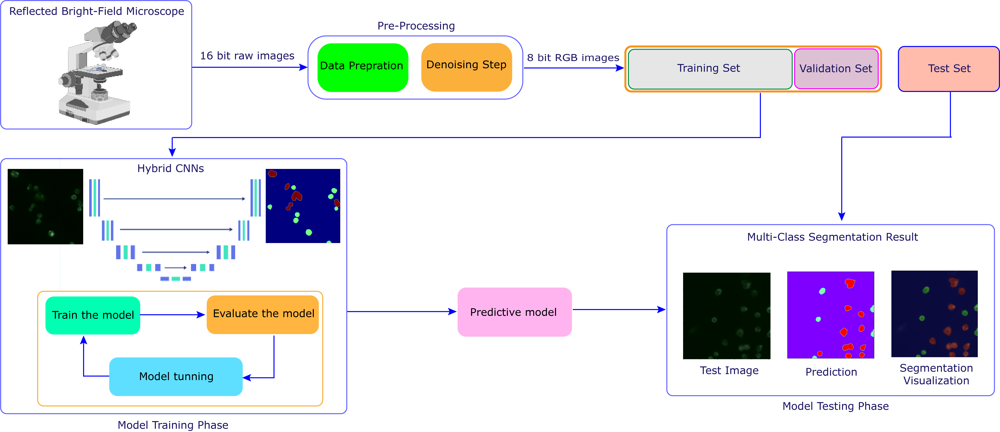
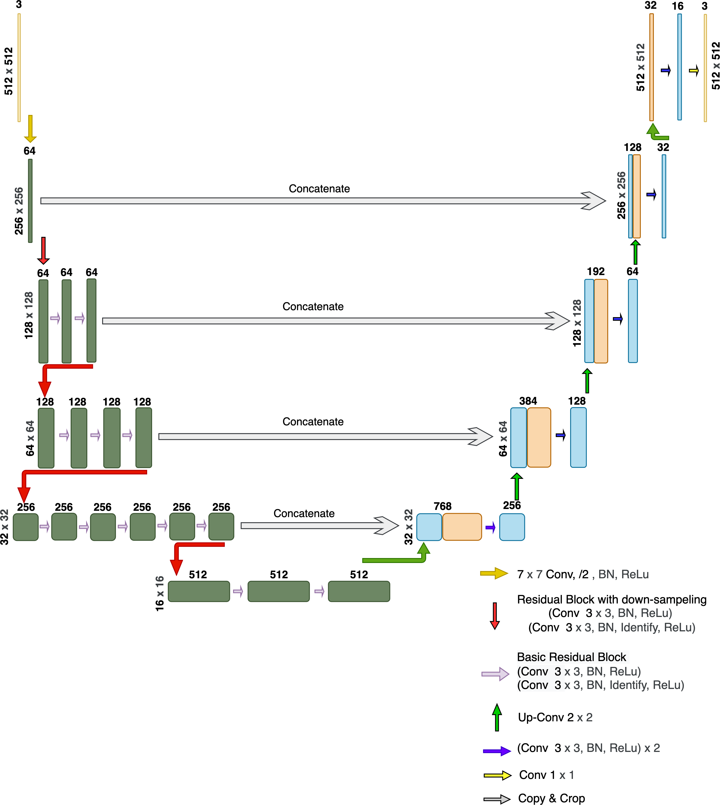

# Different-CNNs- architecture for-multi-class-segmentation


# Different  variant of  U-Net base - Neural Networks architecture for categorical Semantic Segmentation from telecentric reflected microscopic time-series images


**Compression between Different U-Net - Neural Networks architecture for Semantic Segmentation** <br />

[Ali Ghaznavi<sup>∗</sup>](http://web.frov.jcu.cz/cs/o-fakulte/soucasti-fakulty/ustav-komplexnich-systemu-uks/labo-exp-komplex-systemu), 
[Renata Rychtáriková<sup>∗</sup>](http://web.frov.jcu.cz/cs/o-fakulte/soucasti-fakulty/ustav-komplexnich-systemu-uks/labo-exp-komplex-systemu), 
[Petr Císař<sup>∗</sup>](http://web.frov.jcu.cz/en/about-faculty/faculty-parts/institute-complex-systems/lab-signal-image-processing2),
[Mohammadmehdi Ziaei<sup>∗</sup>](http://web.frov.jcu.cz/en/about-faculty/faculty-parts/institute-complex-systems/lab-signal-image-processing2),
[Dalibor Štys<sup>∗</sup>](http://web.frov.jcu.cz/cs/kontakty-frov-ju/181-prof-rndr-dalibor-stys-csc) <br />
(* *indicates equal contribution*)


## Abstract


## Introduction

##### Hybrid deep-learning multi-class segmentation of HeLa cells in reflected light microscopy images ###### 

The data  achieved by reflected light microscope from living Hela cells in different time-laps experiments under the condition already have been described in manuscript and divided to train, test and validation sets.

The labeled data have been prepared manually to train with the deep learning based methods

The models have been trained based on four hybrid different CNN architecture (with the size of 512 * 512) to achieve the best segmentation result already reported in manuscript.


## (1) Dataset and pre-trained model

**The Data-Set is Available in below links:**

[To download Dataset you can use this link:] [Click Here](https://datadryad.org/stash/share/D19v1HCHpsvAos7DPFZaJOAvyMP80ZjiskRruodzwKs)	"Microscopic data-set web directory include:       Training, Testing and Validation datasets are separately available in the linked repository."

[To download trained models and supplementary data you can use this link:] [Click Here](https://drive.google.com/drive/folders/16-K-b_wDW2kO54HvrpUXLIxUoeKoNN_p?usp=sharing)	"Trained Models and other supplementary data:       Simple Unet, Vgg19-Unet, Inception-Unet, ResNet34-Unet models are separately available in the linked repository."

## (2) Methodology and DNN Architectures

We use this Deep Neural Network architecture:
Modelling Bright Filed Dataset on U-Net Networks:


<p align="center">  </p>


**Important hyperparameters setup:**

 Image Size  = 512 * 512

 number of layer ; default = 5

 Activation function =  ReLU

 epoch size; default = 200

 batch size; default = 8

 Early Stop = 30

 learning rate ; default = 10e -3

 dropout_rate = 0.05


<p align="center">  </p>

## (3) Usage

**To run the script please use this file on Google Colab or Jupyter Notebook:**

```python
Unet+Vgg+inception_ResNet(Document_Colab).ipynb
```


## (4) Evaluation and metrics

**We uses evaluation Metrics for experimental results:**

Precision, Recall, Intersection over Union (IoU), Accuracy, Dice 

## (5) Citation

If you find our work useful in your research, please consider citing:

    @article{unknown,
    author = {Ghaznavi, Ali and Rychtarikova, Renata and Cisar, petr and Ziaei, MohammadMehdi and Stys, Dalibor},
    year = {2022},
    month = {03},
    pages = {},
    doi = {}
    title = {Hybrid deep-learning multi-class segmentation of HeLa cells in reflected light microscopy images}
    }

## (6) Updates

* 20/04/2023: Creat the Repo

* -----: Initial release.
